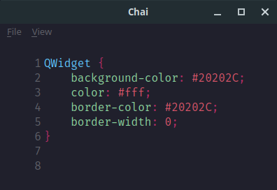

# Chai

Chai is a a minimal code editor written in Python. It supports theming via `json`
files, and will in the future support scripting with Python



## Installation
Chai requires PyQt5, and Qscintilla for Python. Install these with `pip`, then run
`python3 main.py`

## Themes
*TODO: create option to load other json themes, not just the default*

For now you can edit the default `themes/minute.json` theme. Themes are structured as follows:
```json
{
    "lang-extension": {
        "Type": "color in hex or rgb"
    }
}
```
for Python, the default theme is:
```json
{
	"py": {
		"Comment": "#41505E",
		"CommentBlock": "#41505E",
		"Number": "#5EC4FF",
		"DoubleQuotedString": "#B7C5D3",
		"SingleQuotedString": "#B7C5D3",
		"TripleSingleQuotedString": "#B7C5D3",
		"TripleDoubleQuotedString": "#B7C5D3",
		"Keyword": "#8BD49C",
		"Identifier": "#5EC4FF",
		"HighlightedIdentifier": "#8BD49C",
		"ClassName": "#8BD49C",
		"FunctionMethodName": "#8BD49C",
		"Operator": "#B62D65",
		"Decorator": "#E27E8D",
		"UnclosedString": "#D95468"
	}
}
```

For info on available types, visit pyqt.sourceforge.net/Docs/QScintilla2/ and 
look at the available types in the classes for the default Lexers. 